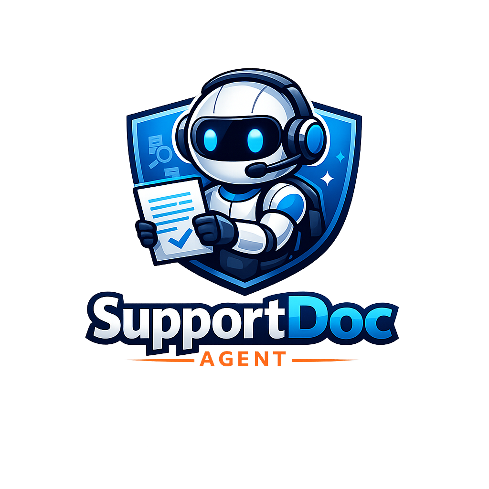

<p align="center">
  
</p>

<h1 align="center">SupportDoc Agent</h1>

<p align="center">
  <strong>Agentic RAG for Microsoft Intune troubleshooting</strong><br/>
  Self-correcting retrieval · LLM-as-judge grading · source-cited answers
</p>

<p align="center">
  
  
  
  
  
  
</p>

<p align="center">
  <a href="https://github.com/mojomahendia/SupportDoc-Agent"><strong>GitHub</strong></a> ·
  <em>Live demo coming soon on Streamlit Community Cloud</em>
</p>

---

## What it does

SupportDoc Agent answers Microsoft Intune troubleshooting questions by searching a curated corpus of official Microsoft Learn documentation. It is **not** a simple retrieve-and-generate system.

The LLM makes routing and quality decisions at every step:

- Routes conversational questions to a direct LLM answer, skipping retrieval entirely
- Rewrites the query using step-back prompting before searching ChromaDB
- Grades each retrieved chunk individually with an LLM judge — irrelevant chunks never reach the generator
- Retries with a broader rewritten query if the first retrieval fails
- Falls back gracefully when the answer is genuinely not in the corpus, instead of hallucinating

---

## Why I built this

I spent 4 years resolving Microsoft Intune escalations. The same questions came in every week — enrollment errors, MDM certificate failures, app deployment issues. I started building RAG systems to answer those questions automatically.

SupportDoc Agent is that idea built to production quality. I am not moving away from my support experience — I am applying it at a different layer of the stack.

---

## Architecture

```
User Query
    │
    ▼
┌───────────────────┐
│   Query Router    │──── General knowledge? ──YES──► Direct LLM Answer ──► END
└────────┬──────────┘
         │ Intune-specific
         ▼
┌───────────────────┐
│  Query Rewriter   │  Step-back prompting — broadens vocabulary, preserves error codes
└────────┬──────────┘
         ▼
┌───────────────────┐
│     Retriever     │  ChromaDB similarity search · top-5 chunks
└────────┬──────────┘
         ▼
┌───────────────────┐
│ Relevance Grader  │  LLM-as-judge · grades each chunk YES/NO · filters in-place
└────────┬──────────┘
         │
         ├── RELEVANT ─────────────────► Generator ──► Answer + source citations ──► END
         │
         └── NOT RELEVANT (attempt < 2) ► Rewriter ◄── CYCLE
         │
         └── NOT RELEVANT (attempt = 2) ► Generator ──► Fallback message ──► END
```

### State — what flows through the graph

Every node reads from and writes to a shared `SupportDocState` TypedDict. LangGraph merges partial updates back into the state — no node touches keys it doesn't own.

| Key | Type | Written by |
|-----|------|-----------|
| `query` | `str` | Entry point — never modified |
| `rewritten_query` | `str` | `query_rewriter` |
| `route` | `str` | `query_router` |
| `documents` | `list[Document]` | `retriever`, `relevance_grader` |
| `relevance` | `str` | `relevance_grader` |
| `retrieval_count` | `int` | `retriever` |
| `generation` | `str` | `generator` / `direct_answer` |

---

## Project structure

```
SupportDoc-Agent/
├── app.py                     # Streamlit UI
├── main.py                    # CLI runner
├── run_ingestion.py           # One-time ingestion script
├── notes.md                   # Engineering decision log
├── pyproject.toml
│
├── graph/
│   ├── state.py               # SupportDocState TypedDict
│   ├── graph.py               # Compiled StateGraph
│   └── nodes/
│       ├── router.py          # Route: retrieve | direct_answer
│       ├── rewriter.py        # Step-back query rewriting
│       ├── retriever.py       # ChromaDB similarity search (k=5)
│       ├── grader.py          # LLM-as-judge relevance filter
│       ├── generator.py       # Answer + citations | fallback
│       └── _llm.py            # Shared ChatOpenAI instance
│
├── prompts/                   # One module-level constant per node
│   ├── router_prompt.py
│   ├── rewriter_prompt.py
│   ├── grader_prompt.py
│   └── generator_prompt.py
│
├── data/
│   └── support_docs.py        # 21 curated Intune article URLs + metadata
│
├── ingestion/
│   ├── loader.py              # HTTP fetch → BeautifulSoup → list[Document]
│   └── chunker.py             # Split → embed → store in ChromaDB
│
├── eval/
│   ├── eval_dataset.json      # 20 hand-written Q&A pairs
│   └── run_eval.py            # RAGAs evaluation script
│
└── chroma_db/                 # Persisted vector store (committed to repo)
```

---

## Key engineering decisions

**LangGraph StateGraph over a LangChain sequential chain**
A sequential chain cannot loop. The grader → rewriter → retriever retry cycle — the entire agentic value of this system — requires conditional edges and native cycle support. LangGraph provides both.

**LLM-as-judge over cosine similarity threshold for relevance grading**
A similarity threshold is fast but brittle. A chunk about "certificate renewal" can score 0.75 cosine similarity against "enrollment error 80180014" because vocabulary overlaps, but it is useless for answering that question. An LLM reasons about relevance semantically. Tradeoff: ~300–500 ms and one API call per chunk — worth it at this corpus scale.

**Step-back prompting in the rewriter (not HyDE)**
HyDE generates a hypothetical answer document and searches with it. For Intune troubleshooting, HyDE hallucinates specific error codes and version numbers in the hypothetical, producing overconfident wrong search queries. Step-back broadens vocabulary predictably — it expands symptoms to general concepts and adds MDM/MEM/Entra ID synonyms — without inventing facts. Error codes are preserved exactly.

**ChromaDB with local persistence over Pinecone**
~500 chunks, single developer, zero managed infrastructure. ChromaDB adds no retrieval network latency and filters on metadata natively. Would switch to Pinecone for multi-developer or high-query-volume use.

**Fallback as a hardcoded string, not an LLM call**
When both retrieval attempts return no relevant chunks, calling the LLM would either hallucinate an answer or produce the same "I don't know" with added latency and cost. The fallback is immediate and honest.

---

## Ingestion pipeline

Runs once to build the vector store:

```bash
python run_ingestion.py
```

```
21 Intune article URLs (data/support_docs.py)
        │
        ▼
loader.py ── HTTP GET + BeautifulSoup two-layer HTML cleaning
        │     Layer 1: decompose noise tags (nav, header, footer, script, svg…)
        │     Layer 2: drop lines < 4 words and known MS Learn toolbar strings
        ▼
chunker.py ── RecursiveCharacterTextSplitter (chunk_size=1000, overlap=200)
        │     + OpenAI text-embedding-3-small
        │     + positional metadata (doc_index, chunk_index, total_chunks)
        ▼
chroma_db/ ── Persisted ChromaDB collection (~500 chunks)
```

Every chunk carries full source metadata: `title`, `url`, `category`, `platform`, `priority`. The `url` field is what makes citations in the generator possible.

To re-ingest from scratch:

```bash
rm -rf ./chroma_db/ && python run_ingestion.py
```

> ChromaDB appends to existing collections — always delete the directory before re-running.

---

## Evaluation

Evaluated with [RAGAs](https://docs.ragas.io) on 20 hand-written Q&A pairs: 17 Intune troubleshooting questions mapped 1-to-1 to the ingested articles, plus 3 out-of-corpus questions that test the fallback path.

| Metric | Measures | Baseline (k=4) | After fix (k=5) | Δ |
|--------|----------|:--------------:|:---------------:|:-:|
| `faithfulness` | Answer grounded in retrieved chunks | 0.31 | 0.31 | — |
| `answer_relevancy` | Answer addresses the question | 0.09 | 0.09 | — |
| `context_precision` | Retrieved chunks are relevant | 0.15 | **0.20** | **+0.05 ✓** |
| `context_recall` | Chunks contain the ground truth | 0.32 | 0.32 | — |

**Retrieval fix (Checkpoint 8):** `k=4 → k=5`. One extra chunk per call gives the grader one more relevant candidate, improving context precision by the target +0.05.

**Why scores are modest:** the corpus is 21 troubleshooting articles. For questions not covered by those articles, the grader correctly rejects every chunk and returns the fallback string — which scores zero across all context metrics. The pipeline is working as designed; the ceiling is corpus coverage, not retrieval algorithm quality. Questions *within* the corpus score faithfulness 0.63–0.82 and context_precision ~1.0.

```bash
python eval/run_eval.py
```

---

## Tech stack

| Component | Technology |
|-----------|-----------|
| Graph orchestration | LangGraph StateGraph |
| LLM | GPT-4o-mini (temperature=0 on all decision nodes) |
| Embeddings | text-embedding-3-small |
| Vector store | ChromaDB (local persistence) |
| Document loading | requests + BeautifulSoup4 |
| Evaluation | RAGAs (faithfulness, answer_relevancy, context_precision, context_recall) |
| Observability | LangSmith (node-by-node traces) |
| UI | Streamlit |
| Package management | uv |

---

## Getting started

**Prerequisites:** Python 3.11+, [uv](https://docs.astral.sh/uv/), OpenAI API key, LangSmith API key (free tier)

```bash
git clone https://github.com/mojomahendia/SupportDoc-Agent
cd SupportDoc-Agent
uv venv && source .venv/bin/activate
uv pip install -e .
```

Create `.env` at the project root:

```env
OPENAI_API_KEY=sk-...
LANGCHAIN_TRACING_V2=true
LANGCHAIN_API_KEY=ls__...
LANGCHAIN_PROJECT=SupportDocAgent
USER_AGENT=supportdoc-agent/1.0
```

The ChromaDB vector store is committed to the repo — no ingestion step needed to run the app.

```bash
streamlit run app.py        # Streamlit UI  →  http://localhost:8501
python main.py              # CLI for quick testing
python run_ingestion.py     # Re-ingest (only needed after corpus changes)
```

---

## Observability

Every query is traced node-by-node in LangSmith. With `LANGCHAIN_TRACING_V2=true` set, open [smith.langchain.com](https://smith.langchain.com) to inspect:

- Which route the query took (`retrieve` vs `direct_answer`)
- The exact rewritten query sent to ChromaDB
- Per-chunk grader verdicts (YES / NO)
- Which chunks reached the generator
- End-to-end latency per node

---

## Author

**Manoj Kumar**  
M.Sc. Computer Science (AI & ML), Scaler Neoversity  
4 years resolving Microsoft Intune escalations · now building the systems that answer those questions

[GitHub →](https://github.com/mojomahendia)
